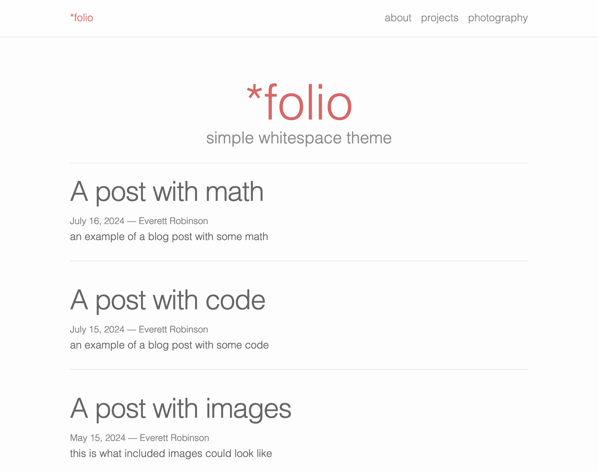

# *folio

[](https://zola-folio.pages.dev/)

*folio is a [Zola](https://www.getzola.org) theme forked from the [original Jekyll theme by Lia Boegev](https://github.com/bogoli/-folio/tree/master).

**[Live Demo](https://zola-folio.pages.dev/)**

## Features

### Menu Bar

Items in the top menu bar can be controlled with the `extra.menu_items` setting in config.toml:

```toml
menu_items = [
    {name = "about", url = "/pages/about"},
    {name = "projects", url = "/pages/projects"},
    {name = "photography", url = "/pages/photography"},
]
```

### MathJax

MathJax can be enabled by setting `extra.math = true` in config.toml. [Example](https://zola-folio.pages.dev/math/).


## Installation

In the git repo of your zola site:

### Add the theme as a git submodule:

```bash
git submodule add https://github.com/evjrob/zola-folio themes/zola-folio
git submodule update --init --recursive
git submodule update --remote --merge
```

### Or clone the theme directly into your themes directory:

```bash
git clone https://github.com/evjrob/zola-folio themes/zola-folio
```

Then set `theme = "zola-folio"` in your config.toml file. You can now test the theme locally by running `zola serve` in the terminal and navigating to the localhost URL displayed by the command.
